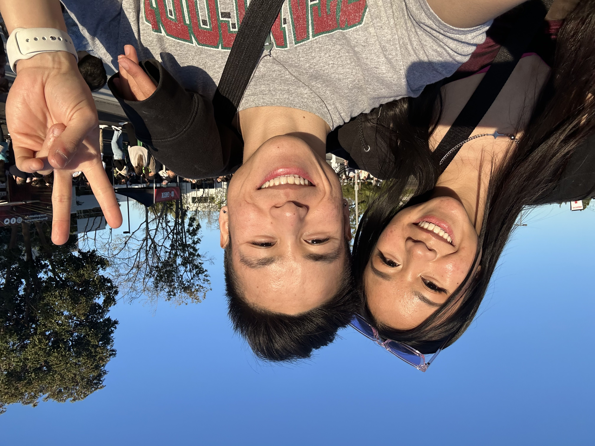
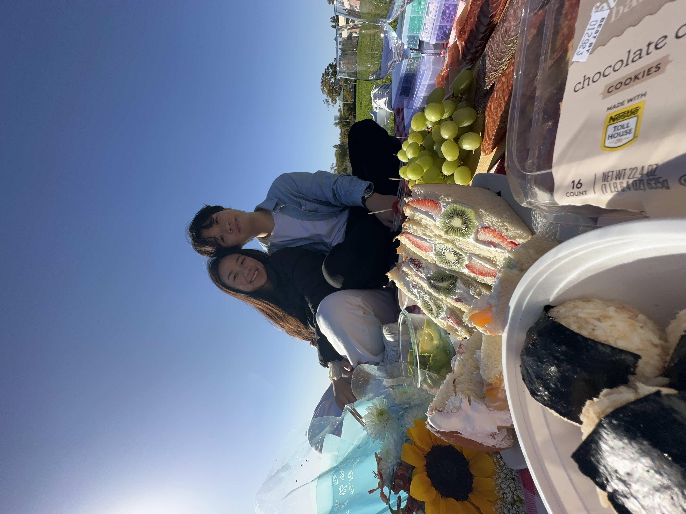
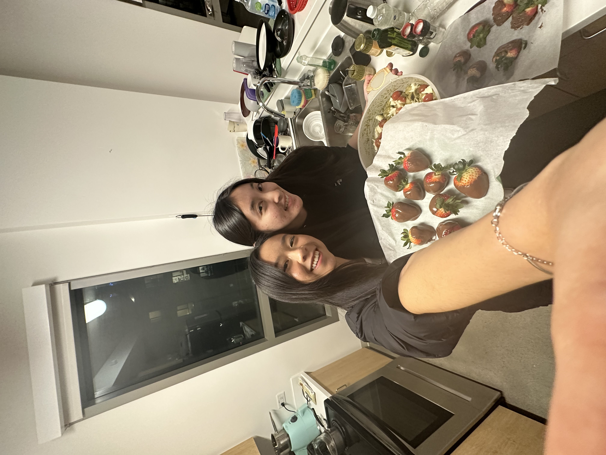
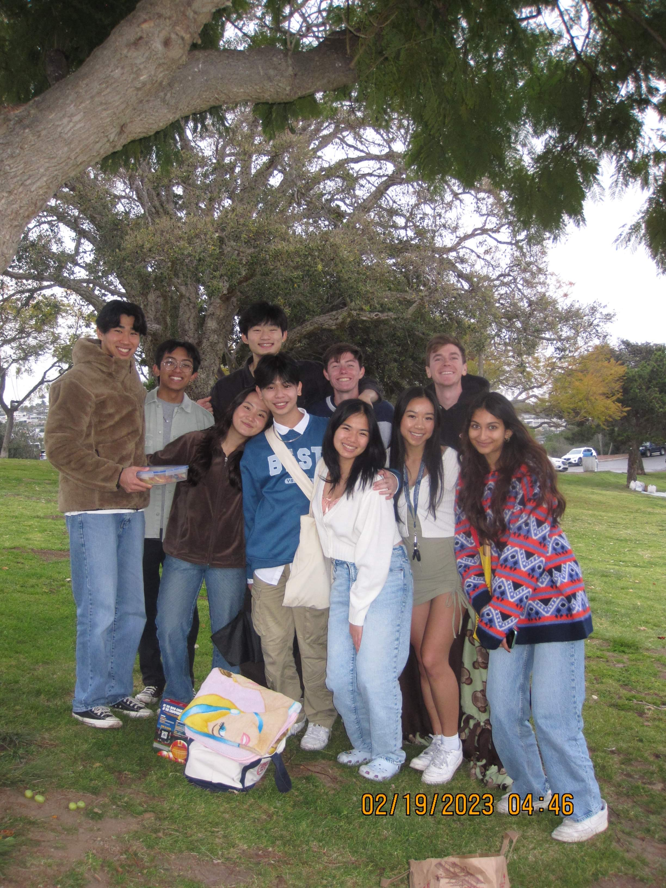

# Welcome!
Or should I say `print("Welcome!")`, since Python is my favorite coding language. On the other hand, if Java is your favorite coding language then you might say:

```
class CSE110 {
    public static void main(String[] args) 
    {
        System.out.println("Welcome!");
    }
}
```

*Anyways*, my name is **Mary Vu** and I'm a student studying computer science at [UCSD](https://ucsd.edu/). ~~If you're bored...~~ If you want to get to know more about me, keep reading!

> 
> <sub>I'm the girl on the left! The guy on the right is my big brother Phil!</sub>

If you want to see more pictures of me and my friends/family, click [here](#gallery) to go to the gallery section.

Here are some of the things I like to do in my free time:
* Cook
* Crochet
* Hang out with friends/family
* Go to the gym (working on consistency though lol)

If I had to order those things from what I do most to what I do least then it would be:
1. Hang out with friends/family
2. Cook
3. Go to the gym
4. Crochet

Some habits that I want to implement this Spring Quarter are:
- [ ] Not skipping lectures
- [ ] Going to sleep at 12 AM latest
- [x] Lowering caffiene intake

## Gallery




